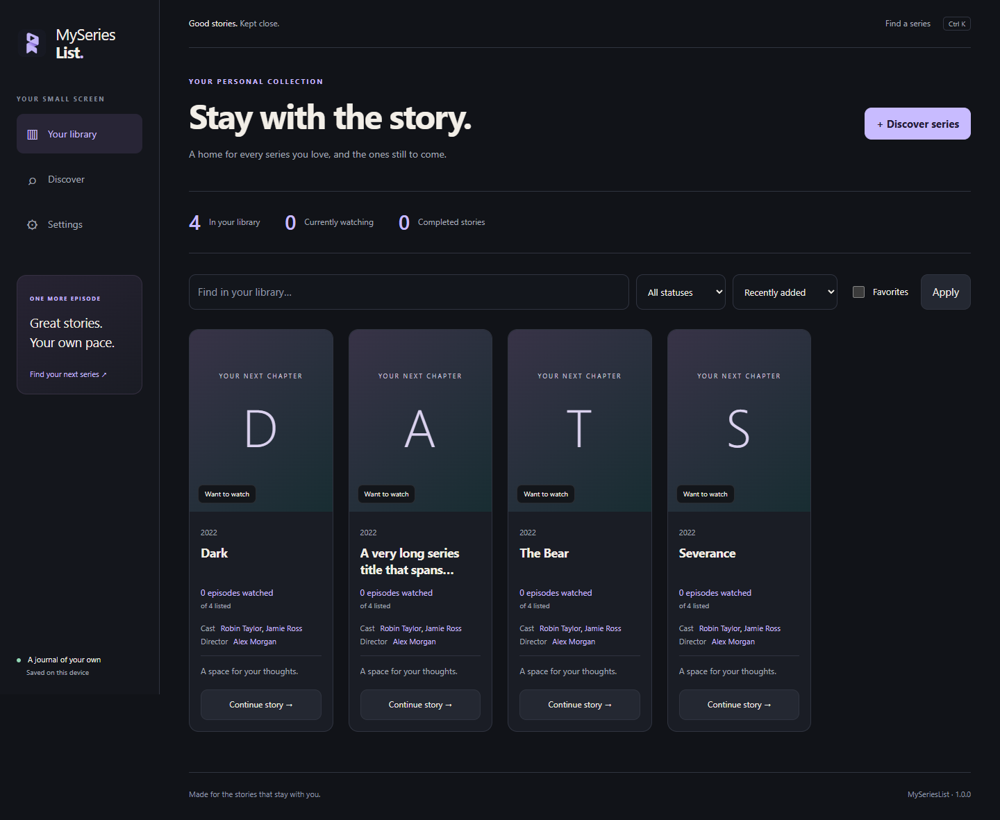
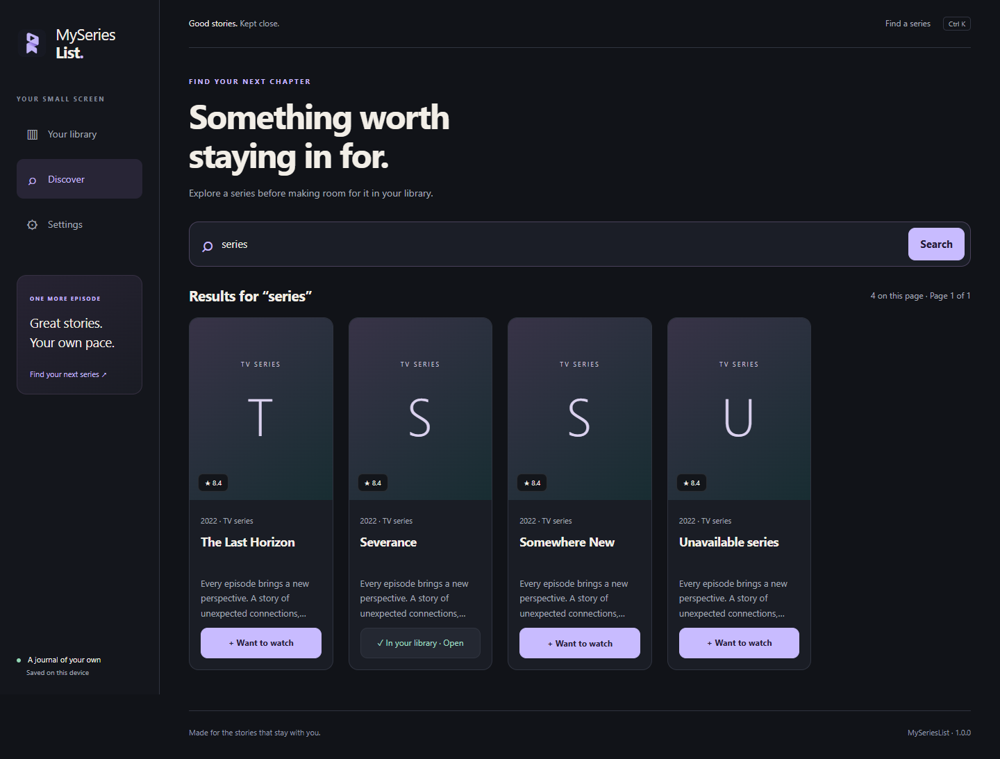
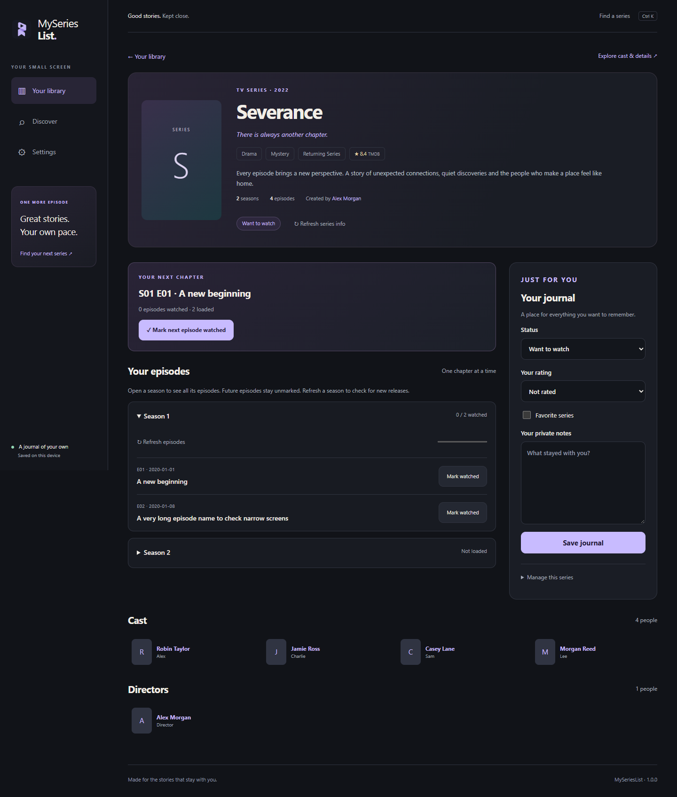
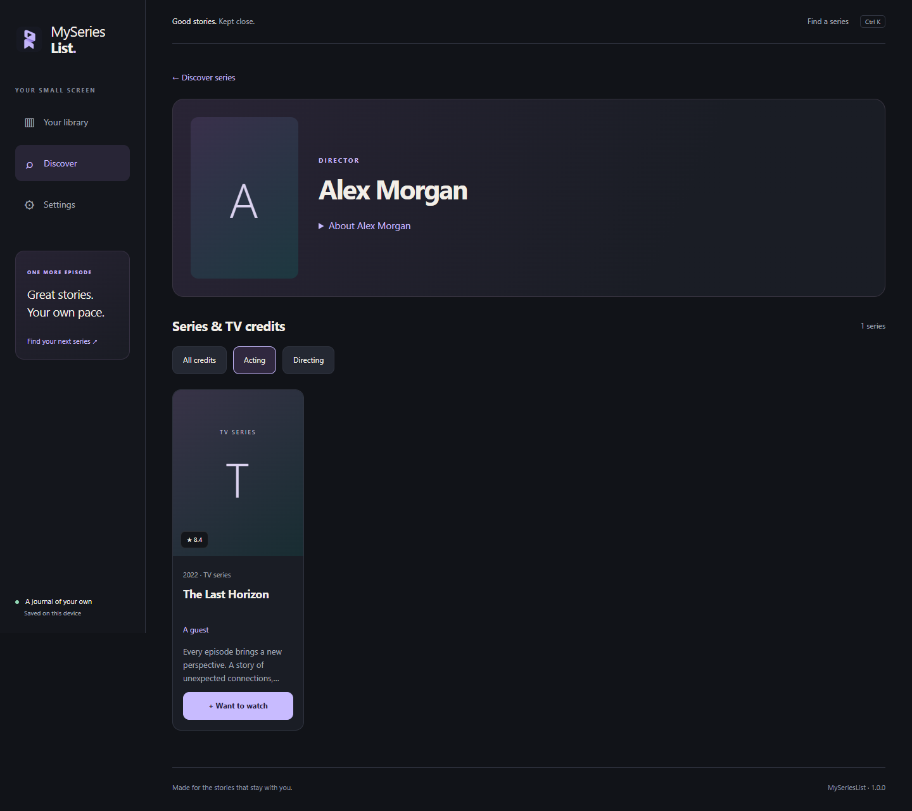

<p align="center">
  
</p>

<h1 align="center">MySeriesList</h1>
<p align="center"><strong>Your shows. Your progress. Your space.</strong></p>
<p align="center">A personal TV series library for Windows. Discover shows, track episodes and keep a private journal—no account or API key required.</p>
<p align="center"><a href="https://github.com/keremakcn/MySeriesList/releases/latest"><strong>Download for Windows</strong></a> · <a href="https://github.com/keremakcn/MySeriesList/releases">All releases</a></p>

## Get started

1. Download **MySeriesList.exe** from the latest release’s **Assets**.
2. Open the app, search for a show and add it to your library.
3. Track episodes and save your notes, rating and favorites.

**Current version: 1.0.0.** No Python installation is needed for the Windows download.

## Features

- Explore show details, cast and seasons before adding a show.
- Track **Want to watch**, **Watching**, **On hold**, **Dropped** and **Completed**.
- Open a season to load its episodes; mark individual episodes or the next episode watched.
- Set a show to **Completed** to mark its aired episodes watched. Future and undated episodes stay unmarked.
- Keep private notes, personal ratings and favorites.
- Explore actors and directors, then discover their other shows.
- Filter and sort your library. Undo removal without losing notes or episode progress.
- Jump to search with **Ctrl+K**.

## Screenshots

Screenshots use an example library.

### Your library



### Discover shows



### Seasons, episodes and your journal



### Explore the cast



## Your thoughts stay yours

Write what you think without publishing it to a public profile. Your notes, ratings, favorites and episode progress are stored on your computer and are not uploaded to our discovery service or TMDB.

Searches and catalog requests go through our shared discovery service to TMDB. Discovery and remote images need internet; your saved journal and loaded episodes remain available offline. Local storage is not encrypted.

**Updates preserve your library.** Close the app before replacing the EXE. Data remains in `%APPDATA%\SeriesWatchlist\series.db`; the original folder name is retained for compatibility. MyMovieList and MySeriesList keep separate libraries.

## Run from source

Python 3.12 recommended:

```powershell
python -m venv .venv
.\.venv\Scripts\python -m pip install -r requirements-desktop.txt
.\.venv\Scripts\python run_desktop.py
```

To build the Windows executable, run `.\build.ps1`. For development and test details, see [QA results](QA_RESULTS.md).

## Credits

TV data and images are provided by [TMDB](https://www.themoviedb.org). This product uses the TMDB API but is not endorsed or certified by TMDB.
